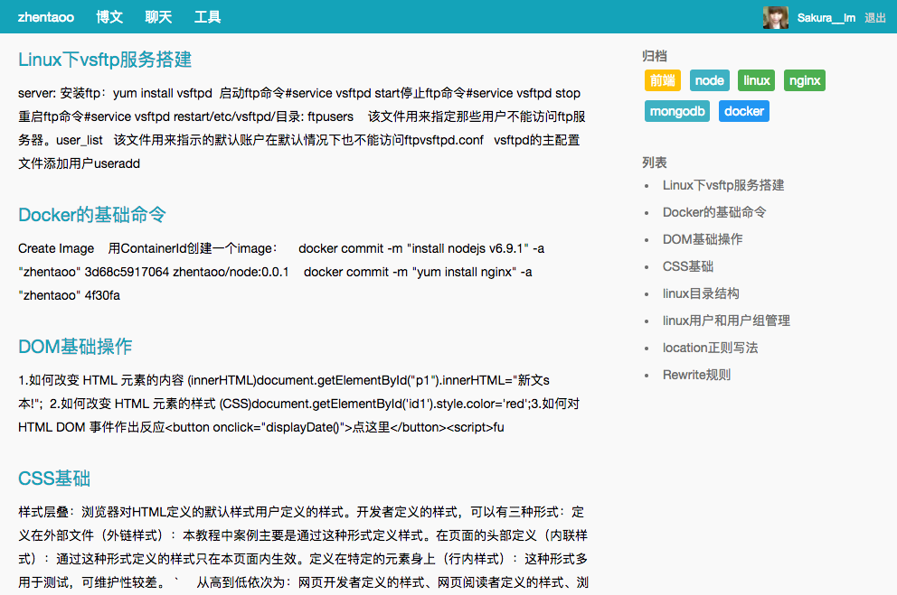
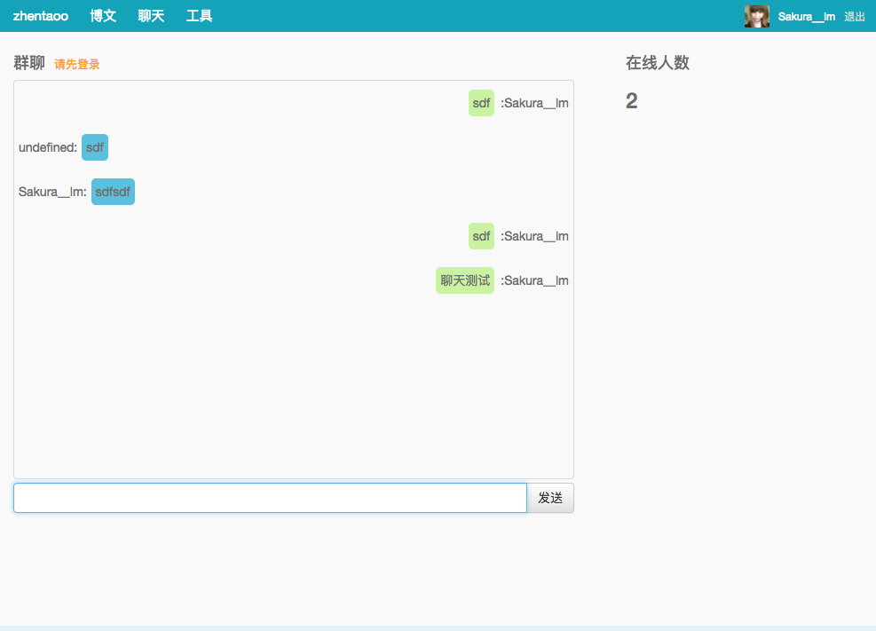

# N-Blog

## 网站的技术结构
* nodejs(express) + mongodb
* 网站地址：http://www.zhentaoo.com
* 服务器在阿里云，网站已备案.

## 运行说明
  1. npm install -g node-dev 安装node-dev,方便开发
  2. 在src/config 目录下新建 admin.js，在登陆后台时会用到
      ```
        module.exports = {
          name : 'xxx',
          pwd: 'xxxxxxx'
        }
      ```
  3. 安装mongodb，并启动
  4. npm start启动项目

## 网站的几个基础功能：
  * 第三方登录接入
    * weibo 登录接入

  * 在线聊天功能
    * 登录后可以在公共频道发言

  * 博客功能
    * 后台文章发布
    * 前台文章倒叙展示，limit 15
    * 前台文章分类：类别，每个类别下的列表

## 效果展示
  * 博客首页
  - 

  * 聊天功能
  - 

## 想说的话
  1. 这是一个纯技术性的个人博客，旨在学习nodejs，提高自己的综合能力
  2. 本人会把一些技术文章学习心德发布到这里，大家没事可以来吐槽／学习一下
  3. 有人愿意交流的话，可以访问网站，下面有QQ群可以加入
